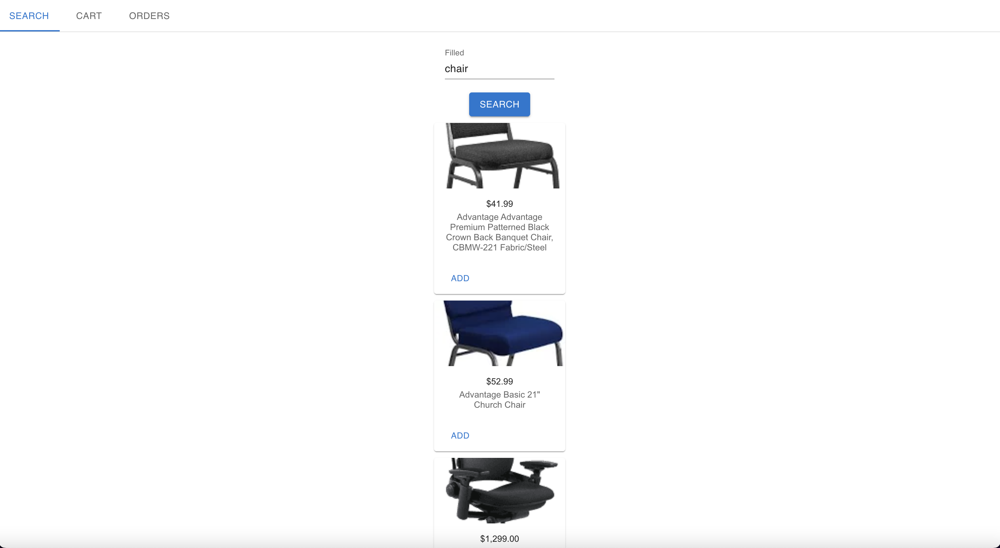
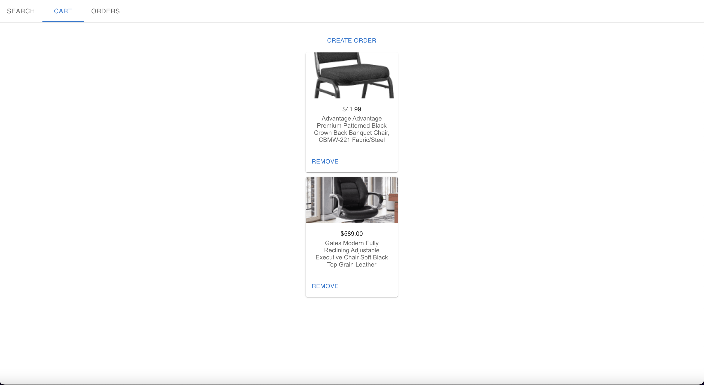
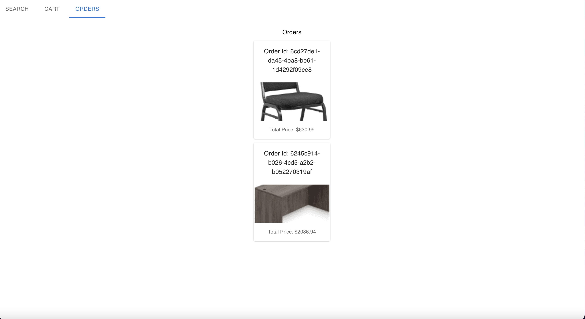

# Shopping App

Shopping App is an application that allows users to search for their favorite products, store them in a cart and create orders. Product information is collected through the serpapi api

## Features and Implementation

### Search results

Users interact with a simple react interface and search for products

### Cart

Users can add items to their cart from the search page and remove items from the cart page. Once the cart is ready, users can create an order

### Orders

Orders are stored in the backend in a sqlite database, and once they are created users are able to view their order history in the orders tab

### Future Develepment

* User authentication, application is sort of useless until there is auth in front of it
* Security issues in the backend such as using env vars for tokens, possible sql injection issue
* Probably a better design than using localstorage directly. I know Redux was popular in the past, Context API is used for certain cases so decision
needs to be made based on application needs
* Use ORM under the right circumstances, depending on how app grows
* Infrastructure design changes if app gets significant load, replicate application and run behind a load balancer
* Use cacheing to speed up search results

## Available Scripts

In the project directory, you can run:

### `npm start`

Runs the app in the development mode.\
Open [http://localhost:3000](http://localhost:3000) to view it in your browser.

The page will reload when you make changes.\
You may also see any lint errors in the console.

This only runs the frontend of the app, you will also need to run the backend which can be found [here](https://github.com/hrantm/shoppingBackend)
